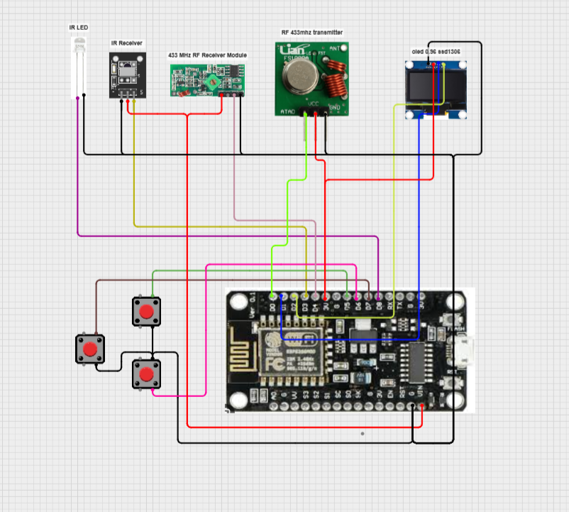

# FSociety Tool

**Portable Multi-Function ESP8266 Tool**

---

# 🚀 Features

| **Category** | **Available Functions** |
|:------------|:------------------------|
| **📶 WiFi** | Scan • Select AP • Attack • Beacon Spam • Graph |
| **📡 RF 433 MHz** | Jammer • Read • Send • Delete • Analyzer |
| **📺 Infrared (IR)** | TV-B-Gone • Jammer • Read • Send • Delete |
| **🎮 Games** | Pong • Breakout |
| **🛠 System** | Evil Portal • EEPROM Storage • Splash Screen • About |

# 🔌 Wiring

| **Component** | **ESP8266 Pin** | **GPIO** |
|--------------|----------------|----------|
| **OLED SDA** | D2 | GPIO4 |
| **OLED SCL** | D1 | GPIO5 |
| **Button UP** | D5 | GPIO14 |
| **Button DOWN** | D6 | GPIO12 |
| **Button SELECT** | D7 | GPIO13 |
| **433 MHz TX DATA** | D0 | GPIO16 |
| **433 MHz RX DATA** | D4 | GPIO2 |
| **IR LED** | D8 | GPIO15 |
| **IR Receiver OUT** | D3 | GPIO0 |

> **Note:** All buttons use the internal pull-up resistors. Connect one side of each button to **GND** and the other side to the corresponding GPIO.

---

# ⚡ Installation

1. Open **web.esphome.io**
2. Connect your **ESP8266** via USB
3. Click **Connect**
4. Select **FSociety_Tool.bin**
5. Set Flash Address to **0x0**
6. Click **Program**
7. Wait until flashing is complete

---

# 🎮 Controls

| **Button** | **Action** |
|-----------|-----------|
| **UP** | Navigate Up |
| **DOWN** | Navigate Down |
| **SELECT** | Confirm / Enter |
| **HOLD SELECT** | Exit Current Mode |

---

---

---

# ℹ️ About

**FSociety Tool** was created and developed by **Ahmadreza**.

---

# ⚠️ Disclaimer

This project is intended for educational and research purposes only.

The author is not responsible for any misuse, damage, or illegal activities resulting from the use of this software. Use it only on devices, systems, and networks that you own or have explicit permission to test.

